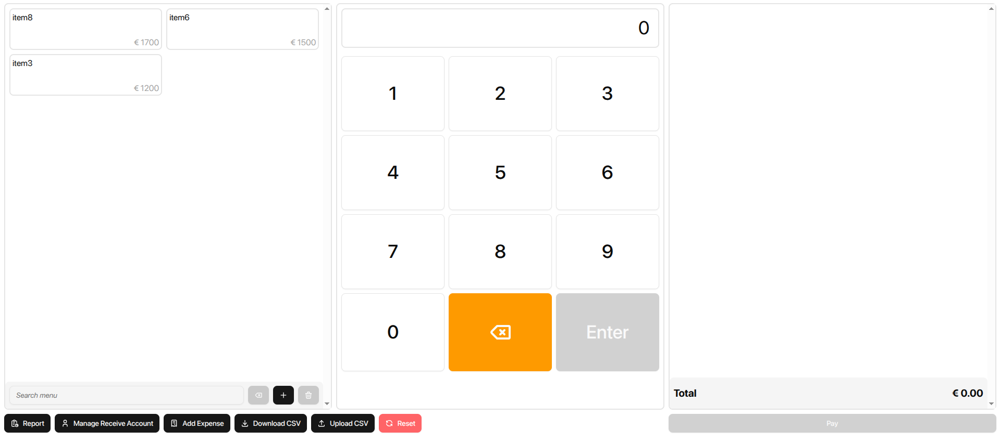

# Cash Register

A modern point-of-sale (POS) system built with React, TypeScript, and Vite. This application provides a user-friendly interface for managing sales, expenses, and generating reports.



## Features

- 🛍️ **Menu Management**

  - Add, edit, and delete menu items
  - Quick search functionality
  - Real-time price calculations

- 💰 **Order Processing**

  - Intuitive numpad interface
  - Multiple items per order
  - Order preview and confirmation
  - Payment processing with multiple payment accounts

- 📊 **Reporting**

  - Sales line charts
  - Detailed order records
  - Export/Import data via CSV
  - Refund management

- 💸 **Expense Management**

  - Track expenses
  - Manage receiving accounts
  - Expense categorization

- 🌐 **Internationalization**
  - Multi-language support
  - Easy language switching
  - Extensible translation system

## Tech Stack

- **Frontend**: React, TypeScript
- **State Management**: Jotai
- **Routing**: TanStack Router
- **UI Components**: Radix UI, TailwindCSS
- **Charts**: Recharts
- **Form Handling**: React Hook Form, Zod
- **Internationalization**: i18next
- **Build Tool**: Vite

## Getting Started

1. Clone the repository
2. Install dependencies:
   ```bash
   npm install
   ```
3. Start the development server:
   ```bash
   npm run dev
   ```
4. Build for production:
   ```bash
   npm run build
   ```

## Data Management

- Data is persisted locally using browser storage
- Import/Export functionality via CSV files
- Automatic data backup and restoration

## Contributing

1. Fork the repository
2. Create your feature branch
3. Commit your changes
4. Push to the branch
5. Create a new Pull Request

## License

This project is private and not open for public use.

## Development

The project uses several modern development tools and practices:

- ESLint for code linting
- Prettier for code formatting
- TypeScript for type safety
- Vite for fast development and building
